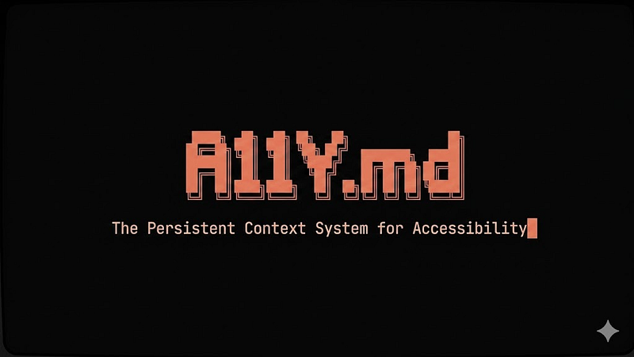

🇺🇸 Read in English: ./README.md

> ⚠️ Esta é a versão original em português.
> A versão oficial e atualizada do projeto (e da Wiki) está em inglês.

  
    
  <h1>Project A11Y.md</h1>
  
<b>O Sistema de Contexto Persistente para Acessibilidade</b>

  
  
  
  
  
  
   
  <a href="https://github.com/fecarrico/A11Y.md/wiki" target="_blank">📖 Leia a Wiki Oficial</a> | <a href="https://fecarrico.github.io/a11ymd/" target="_blank">🌐 Site Oficial</a> | <a href="https://medium.com/ux-user-experience-design-em-portugues/a11y-md-acessibilidade-antes-de-qualquer-prompt-5c8778ccb310" target="_blank">📝 Leia o Manifesto (Medium)</a>

 

> **O A11Y.md não é um guia de boas práticas.**
> Ele é um protocolo de validação de acessibilidade e uma **arquitetura de contexto persistente** para o desenvolvimento de softwares guiado por IA. Foi concebido para integrar-se com agentes autônomos (Cursor, Claude, Copilot) garantindo conformidade certificável desde a origem.

Nós tratamos arquivos como `.gitignore`, `eslint` e `CLAUDE.md` como verdades canônicas nos nossos repositórios. Mas por que a acessibilidade não é canônica? O `A11Y.md` traduz as regras de acessibilidade para uma camada de governança portátil: um **núcleo normativo agnóstico de plataforma** (POUR, perfis de conformidade, severidade, governança) com **referências web maduras** e uma **camada de tradução nativa** (iOS, Android, React Native, Flutter). Em vez de regras genéricas, ele força qualquer agente a aderir estritamente às normas WCAG 2.2 AA e ADA desde a primeira linha de código gerada.

---

## ⚡ Core Features (Inovações)

- 🧠 **Contrato Comportamental da IA (11 Regras):** Restrições determinísticas que forçam a IA a atuar como tradutora semântica (Framework Adaptation, Platform Awareness), a reutilizar os componentes existentes do projeto em vez de recriá-los (Component Reuse + Decision Memory) e a parar de gerar anti-padrões destrutivos (como `divs` clicáveis).
- 🛡️ **Compliance Profiles Modulares:** Suporte aos perfis Shield (AAA), Standard (AA) e **Launchpad (A)** — cada um separando o que a WCAG realmente exige (citado por Critério de Sucesso) das **Regras da Casa** mais estritas deste padrão. O perfil Launchpad permite que startups construam MVPs rápidos relaxando regras visuais cosméticas, sem nunca sacrificar a estrutura semântica crítica.
- 📚 **Lazy Context Loading:** 21 guias de referência (WAI-ARIA APG). A IA é programada para carregar apenas os guias necessários sob demanda, economizando tokens e mantendo o foco afiado.

---

## 🚀 Quick Start (Menos de 2 minutos)

Ler sobre acessibilidade é o primeiro passo, injetá-la no código é o objetivo real. Faça isto **agora** no seu projeto:

1. **Aponte sua IA para o Padrão:** Adicione **uma regra** ao arquivo de configuração do seu agente (`.cursorrules`, `CLAUDE.md`, `AGENTS.md`, `copilot-instructions.md`…):
   > *"Ao desenvolver o frontend, siga estritamente as regras de acessibilidade definidas no A11Y.md: https://github.com/fecarrico/A11Y.md/blob/main/docs/pt-BR/A11Y.md"*

   Só isso — nenhum arquivo copiado. A IA lê o arquivo núcleo e carrega sob demanda apenas os guias de referência necessários, sempre atualizados. (Prefere inglês? Aponte para `docs/en/A11Y.md`.)
2. **Prefere uma cópia offline ou fixada?** Copie o `docs/pt-BR/A11Y.md` para o seu repositório (raiz, `docs/`, onde quiser) — opcionalmente com as pastas `references/` e `templates/` — e aponte a regra para o caminho local. Se copiar só o arquivo núcleo, a IA usa como fallback os guias deste repositório via URLs upstream.
3. **Defina o Perfil:** A IA perguntará proativamente qual Compliance Profile (Shield, Standard ou Launchpad) ela deve usar, caso você não tenha especificado.

👉 **<a href="https://github.com/fecarrico/A11Y.md/wiki/Setup-and-Integration" target="_blank">Leia o guia completo de Setup e Integração na nossa Wiki.</a>**

---

## 📖 Documentação Oficial (A Wiki)

A arquitetura completa, protocolos e exemplos práticos estão profundamente documentados na nossa Wiki no GitHub (em Inglês).

**<a href="https://github.com/fecarrico/A11Y.md/wiki" target="_blank">🔗 Visite a Wiki do A11Y.md</a>**

Lá dentro você encontrará:
- **O Command Center:** Como o arquivo principal A11Y.md funciona.
- **Anti-patterns & Protocol:** Casos reais de alucinações de IA sendo corrigidas nativamente.
- **Reference Library:** A taxonomia dos 21 guias de engenharia.
- **Evidence & Research:** Os dados de campo aos quais o padrão responde — benchmarks e estudos publicados, com fontes.
- **Governança & Compliance:** Preparação técnica para auditorias formais.

---

## 🔍 O Impacto Prático (Antes vs Depois)

A diferença entre um código gerado aleatoriamente e um código guiado pelo `A11Y.md`:

**❌ Sem o Contexto A11y:**
- IA gerando `
` (quebrando interações via teclado).
- Modais impossíveis de fechar com `ESC` (Focus Trap invertido e inacessível).
- Mensagens de erro visuais que não são lidas por Leitores de Tela.

**✅ Com o Contexto A11y Ativo:**
- Elementos `<button>` nativos usados como regra rígida.
- Foco gerenciado automaticamente após transições de roteamento em SPAs.
- Injeções precisas de `aria-live` para leitura imediata de dados dinâmicos.

---

## 💡 O Paradigma do Projeto

Nossa filosofia determina que a acessibilidade web nunca deve ser um "polimento tardio", mas sim uma **pré-condição de uso técnica**. A estrutura sustenta-se em três pilares:

- 👤 **Human-Centric:** Desenhado estritamente para garantir autonomia real a usuários com deficiência.
- 🤖 **AI-Ready:** Diretrizes determinísticas criadas especificamente para ancorar o comportamento de Agentes de código, ceifando pela raiz a "invenção" (alucinações técnicas).
- ⚖️ **Certifiable:** Cada diretriz no `A11Y.md` é mapeada explicitamente para critérios WCAG 2.2 rigorosos, permitindo uma rastreabilidade direta que blinda a empresa em auditorias.

---

## 🤝 Open Source & Comunidade

O A11Y.md é fundamentalmente uma iniciativa open-source. Em julho de 2026, o projeto foi selecionado para o programa **Claude for Open Source, da Anthropic**, que apoia mantenedores open-source no mundo todo.

Não me coloco como o dono da verdade absoluta em acessibilidade, mas sim como um entusiasta tentando cruzar a ponte entre Inclusão e Inteligência Artificial.

O objetivo deste projeto é ser uma arquitetura viva. Ele depende da comunidade open-source — pessoas muito mais inteligentes e experientes em engenharia de acessibilidade — para contribuir, refinar a biblioteca de referências e tornar esse sistema robusto o suficiente para mudar como soluções digitais são criadas na era do "vibe coding".

**Pull Requests para melhorar os guias de referência ou o Contrato da IA são extremamente bem-vindos!**

---

 

  
<b>Autor & Curadoria</b>

  <h3>Felipe A. Carriço</h3>
  
<i>UX Designer Especialista | AI Product Builder | Daltônico</i>

  
  
Construído a partir da premissa de que a eficiência da inteligência artificial deve, invariavelmente, atuar como alavanca e destruidor de barreiras tanto no mundo físico quanto no digital.

  
  <a href="https://linkedin.com/in/fecarrico" target="_blank">LinkedIn</a> | <a href="https://medium.com/@carrico" target="_blank">Medium</a>

